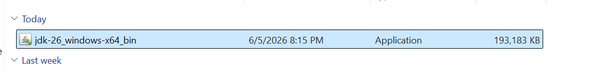
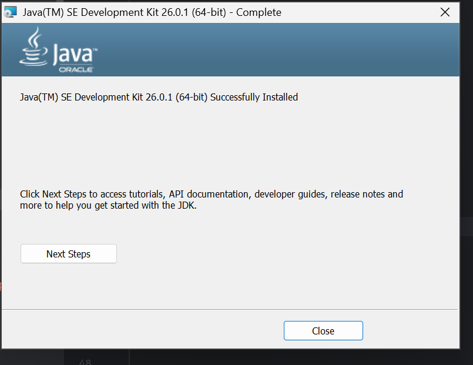
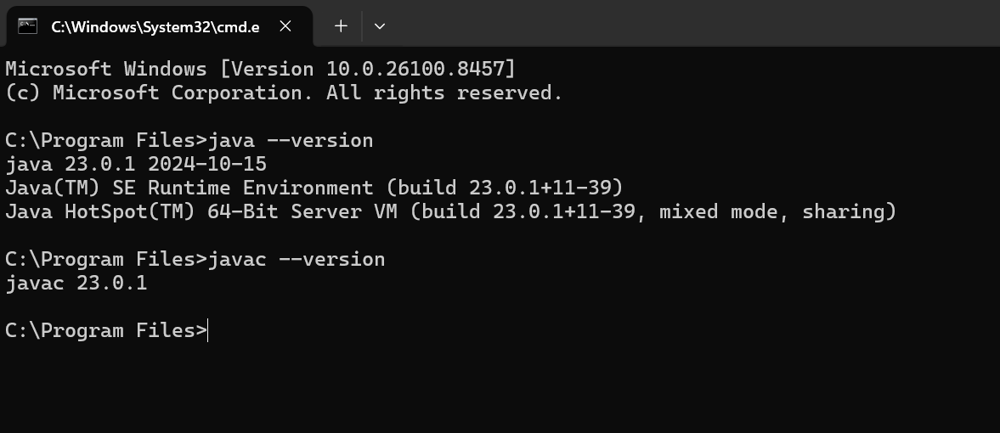
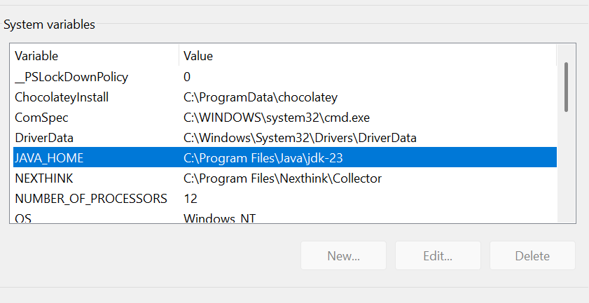
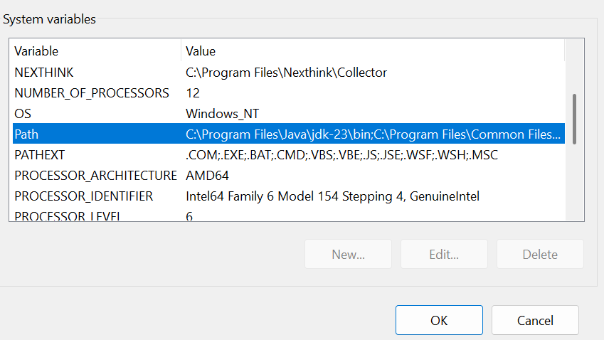

# Java Installation & Configuration Guide

## Objective

This document explains how to install and configure Java Development Kit (JDK) and Java Runtime Environment (JRE) on a Windows machine.

---

## Prerequisites

* Windows 10/11
* Internet connection
* Administrator access

---

## Step 1: Download JDK

1. Visit Oracle JDK Downloads:
   https://www.oracle.com/java/technologies/downloads/

2. Download the latest LTS version (JDK 21 or later).

3. Select Windows x64 Installer.

### Screenshot



---

## Step 2: Install JDK

1. Run the downloaded installer.
2. Click Next.
3. Select installation location.
4. Complete installation.

Example:

C:\Program Files\Java\jdk-26.0.1

### Screenshot



---

## Step 3: Verify Installation

Open Command Prompt and execute:

```bash
java -version
```

Expected Output:

```bash
java version "23.0.1"
```

Verify compiler:

```bash
javac -version
```

Expected Output:

```bash
javac 23.0.1
```

### Screenshot



---

## Step 4: Configure JAVA_HOME

1. Open:
   Control Panel → System → Advanced System Settings

2. Click Environment Variables

3. Under System Variables select New

Variable Name:

```text
JAVA_HOME
```

Variable Value:

```text
C:\Program Files\Java\jdk-21
```

### Screenshot




---

## Step 5: Update PATH Variable

Edit Path variable and add:

```text
%JAVA_HOME%\bin
```

### Screenshot



---

## Step 6: Test Configuration

Open a new Command Prompt.

Execute:

```bash
java -version
javac -version
```

Both commands should execute successfully.

---

## JDK vs JRE

| JDK                       | JRE                       |
| ------------------------- | ------------------------- |
| Used for development      | Used for execution        |
| Contains compiler (javac) | Does not contain compiler |
| Includes JRE              | Runtime only              |

---

## Conclusion

Java has been successfully installed and configured. The system is now ready for Java application development and execution.
